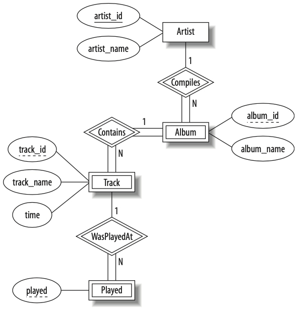

# Fall 2024 Principles of Databases — Assignment 4

* **Do not start this project until you’ve read and understood these instructions. If something is not clear, ask.**

---

## ❖ Introduction ❖

For this assignment, you’ll be revisiting the running music database examples we’ve been using in class. In the first of two steps, you’re going to implement in MySQL an [E/R diagram](https://en.wikipedia.org/wiki/Entity%E2%80%93relationship_model), also known as the entity-relationship model, or ER model, (in [Chen Notation](https://en.wikipedia.org/wiki/Peter_Chen)), of the music database. And, in the second step, you’re going to implement a series of MySQL commands from first step.

---

## ❖ Step I — E/R Diagram Implementation ❖



The E/R diagram above shows a version of the music database we’ve been using as an example in class. The code included in the enclosed `mysql` folder is a partial MySQL implementation of this E/R diagram.

1. Modify the current instance of the MySQL code in the `mysql` folder to match the E/R diagram.
2. Implement the relations `Compiles`, `Contains`, and `WasPlayedAt`.
3. Complete the `Played` entity by matching the first entry to the first track on Dawn of Midi’s _Dysnomia_, the next one to the first track on Interpol’s _Turn on the Bright Lights_, the third one to the first track on The Chrome Cranks’ _Dead Cool_, the fourth one to the first track on The Melvins’ _Houdini_, the fifth and sixth ones to the first track on Mogwai’s _Come on Die Young_ and _Every Country’s Sun_, respectively, and the last one to the first track on Warpaint’s _Heads Up_.
4. Update each relation and/or entity with an `INDEX` on an attribute that you find is most logical.

---

## ❖ Step II — Commands ❖

1. Using MySQL’s [CONCAT](https://dev.mysql.com/doc/refman/8.0/en/string-functions.html#function_concat) function, write a query that generates the following output:

```sql
+---------------------------------------------+
| Recording                                   |
+---------------------------------------------+
| Dawn of Midi recorded Dysnomia              |
| Interpol recorded Turn on the Bright Lights |
| Melvins recorded Houdini                    |
| Mogwai recorded Come on Die Young           |
| Mogwai recorded Every Country’s Sun         |
| The Chrome Cranks recorded Dead Cool        |
| Warpaint recorded Heads Up                  |
+---------------------------------------------+
```

2. Note the tabular MySQL output below. Write a subquery to the following MySQL query `SELECT artist_name FROM artist WHERE artist_id = ();` to achieve this output. **Note**: The empty parens is where you’d include a nested query; it is not a function.

```sql
+-------------------+---------------------------+
| artist_name       | album_name                |
+-------------------+---------------------------+
| Dawn of Midi      | Dysnomia                  |
| Interpol          | Turn on the Bright Lights |
| The Chrome Cranks | Dead Cool                 |
| Melvins           | Houdini                   |
| Mogwai            | Come on Die Young         |
| Mogwai            | Every Country’s Sun       |
| Warpaint          | Heads Up                  |
+-------------------+---------------------------+
```

3. Using the relation `Compiles`, write a MySQL command that shows all the albums created by artists, exactly like the output above.

4. Using the relation `Contains`, write a MySQL command that shows all the tracks belonging to every album. Ensure you include track name and album name.

5. Using the relation `WasPlayedAt`, write a MySQL command that shows all played tracks. Ensure you include track name and track time in your output.

---

## ❖ Rules ❖

* All E/R diagram-related MySQL syntax from **Step I** must go in the `.sql` files within the `mysql` folder.
* All commands — each separated by a newline — from **Step II** must go in the `commands.sql` file, which is in the root of this repo.
* Do not edit any of the `.gitignore` files.
* All the files required to bring this project to fruition are included, with the following exceptions:
    1. You may define and include variables in a file called `variables.sql`, which must be placed in the included `mysql` folder. The `.gitignore` file in the `mysql` folder already lists `variables.sql` in its whitelist (allowlist) manifest.
    2. You identified an error in this assignment’s scaffold, and thus need to add one or more files. Announce the error in our class’ Microsoft Group so everyone is aware. **Note**: You’ll need to edit the whitelist in one or more `.gitignore` files to accommodate your change.
* You must use EditorConfig, per the included `.editorconfig` file.

**Note**: Recall that comments in MySQL are composed of two dashes **followed by a space**, `-- like this`.

---

## ❖ Due ❖

Thursday, 12 December 2024, at 5:00 PM.

---

## ❖ Grading ❖

| Item                          | Points |
|-------------------------------|:------:|
| E/R diagram implementation    | `25`   |
| MySQL commands implementation | `25`   |
| Syntax quality                | `25`   |
| Following instructions        | `25`   |

---

## ❖ Submission ❖

**NO late submissions will be accepted.**

You will need to issue a pull request back into the original repo, the one from which your fork was created for this project. See the **Issuing Pull Requests** section of [this site](http://code-warrior.github.io/tutorials/git/github/index.html) for help on how to submit your assignment.

**Note**: This assignment may **only** be submitted via GitHub. **No other form of submission will be accepted**.
